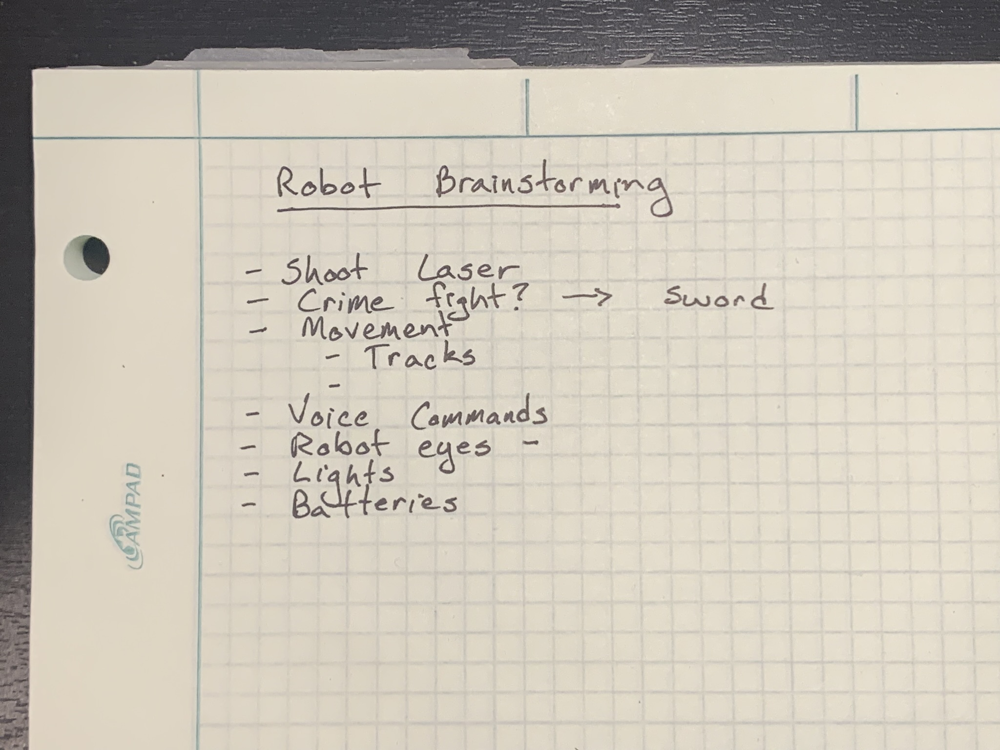

+++
title = 'Dream Big'
date = 2025-01-01T21:47:26Z
draft = false
categories = [""]
tags = [""]
thumbnail = "*brainstorming*"
+++

We know we want to build a robot, but there are so many possibilities.  Where do we start?  A brainstorming session.

## The Brainstorming

I like to start with some pen and paper:

- Shoot lasers
- Crime fight (with a sword)
- Movement
  - Tracks
- Voice Commands
- Eyes
- Lights
- Batteries

The results are a mix of some practical ideas and some more ambitious ones, but we can _Dream Big_!

### The Name

Most imporantly we need a name...___ZOMBO___!

### The Basics

Our plan is to start with the basics. We need:

#### Locomotion and Navigation

Two drive wheels wheels get started and maybe upgrade those to tracks later.  These will be driven by 2 DC motors.

A sonar sensor will provide some collision avoidance.  _Zombo_ will drive forward until it detects a potential collision.  It will stop, rotate some number of degrees, and drive forward again until it detects another potential collision.

#### Commands

We will use voice commands to provide input to _Zombo_.

#### Lights

LED can provide us some feedback on what _Zombo_ is doing as well as make it look cool.
